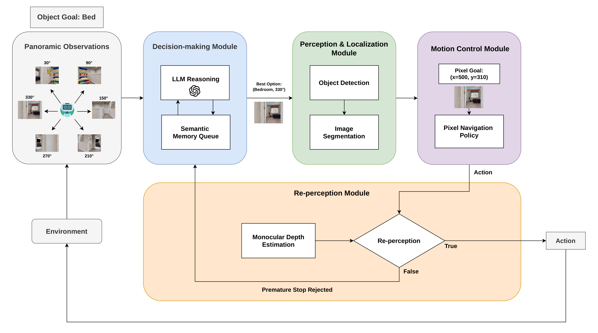

# QR-Nav: LLM-Based Mapless Zero-Shot Object Goal Navigation



---

## System Overview

The system consists of four modules:

| Module | Role |
| :--- | :--- |
| **Decision-making Module** | GPT-4o reasons over panoramic observations and a Semantic Memory Queue to select the best exploration direction |
| **Perception & Localization Module** | GroundingDINO detects the target object; SAM produces a pixel-level mask as the navigation goal |
| **Motion Control Module** | PixelNav policy executes low-level navigation toward the pixel goal |
| **Re-perception Module** | Depth Anything V2 validates whether the robot has truly reached the target, rejecting premature stops |

---

## Dependency

This project is built on [habitat-sim](https://github.com/facebookresearch/habitat-sim) and [habitat-lab](https://github.com/facebookresearch/habitat-lab). Please follow their installation guides and download the navigation scenes and episode datasets for object navigation:

- **Scenes & Episodes**: [HM3D, MP3D](https://github.com/facebookresearch/habitat-lab/blob/main/DATASETS.md)

Additional Python dependencies:

```
numpy, opencv-python, tqdm, openai, torch, imageio
```

---

## Installation

Clone this repository:

```bash
git clone https://github.com/ytcheng0822/QR-Nav.git
cd QR-Nav
```

Install the open-vocabulary detection and segmentation modules:

```bash
cd third_party/GroundingDINO
pip install -e .
cd ../Segment-Anything/
pip install -e .
```

Install the monocular depth estimation module:

```bash
cd third_party/Depth-Anything-V2
pip install -e .
```

---

## Prepare GPT-4o API Keys

This project uses GPT-4o for panoramic visual reasoning. Set your API credentials as environment variables:

```bash
export OPENAI_API_KEY=<YOUR_KEY>
export OPENAI_API_ENDPOINT=<YOUR_ENDPOINT>
```

See `./llm_utils/gpt_request.py` for details on the API interface.

---

## Download Checkpoints

| Module | Approach | Weight |
| :---: | :---: | :---: |
| Object Detection | GroundingDINO | [groundingdino_swinb_cogcoor.pth](https://drive.google.com/file/d/1kSH6AhUBrr-CxMrm4J3A9Pv__3WlCjDH/view?usp=drive_link) |
| Object Segmentation | SAM | [sam_vit_h_4b8939.pth](https://drive.google.com/file/d/1cc6fk71zAK_8HJQltAKyM65nlcoN1eh1/view?usp=drive_link) |
| Depth Estimation | Depth Anything V2 (Metric) | [depth_anything_v2_metric_hypersim_vits.pth](https://huggingface.co/depth-anything/Depth-Anything-V2-Metric-Hypersim-Small) |
| Navigation Skill | PixelNav | [Checkpoint_A](https://github.com/wzcai99/Pixel-Navigator#download-the-checkpoints) |

Place all checkpoints under `./checkpoints/` and verify the paths in `constants.py`.

---

## Run the ObjectNav Benchmark

Open `constants.py` and confirm all checkpoint paths are correctly set. Then run:

```bash
# HM3D dataset (default)
python qr-nav.py --dataset hm3d --eval_episodes 1000

# MP3D dataset
python qr-nav.py --dataset mp3d --eval_episodes 2195
```

Navigation trajectories are saved as `.mp4` files under `./tmp/`. Each trajectory folder contains:
- `fps.mp4` — first-person observation video
- `metric.mp4` — top-down map video
- `result.mp4` — side-by-side combined view

Evaluation results are written to `objnav_hm3d.csv` or `objnav_mp3d.csv`.

### Additional Arguments

```bash
# Debug: run a specific episode
python qr-nav.py --dataset hm3d --episode_id 9 --scene_id 6s7QHgap2fW

# Resume from a checkpoint (e.g. continue after episode 100)
python qr-nav.py --dataset mp3d --start_episode 100 --eval_episodes 900

# Coverage mode: ensure all scenes and object categories are tested at least once
python qr-nav.py --dataset mp3d --eval_episodes 100 --coverage
```

---

## Results

### HM3D ObjectNav (val, 1000 episodes)

| Method | SR ↑ | SPL ↑ |
| :--- | :---: | :---: |
| **QR-Nav (Full)** | **0.554** | **0.276** |
| w/o Re-perception Module | 0.480 | 0.257 |
| w/o Semantic Memory Queue | 0.430 | 0.237 |
